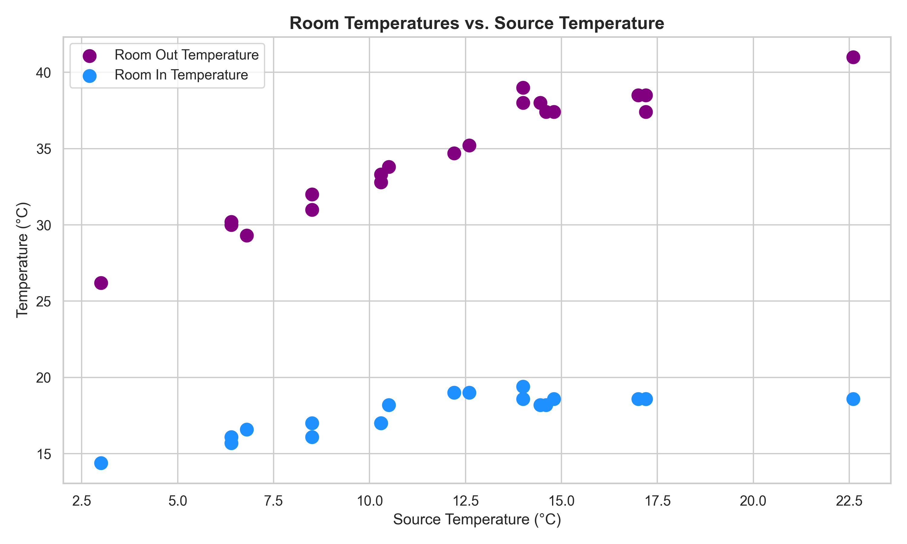
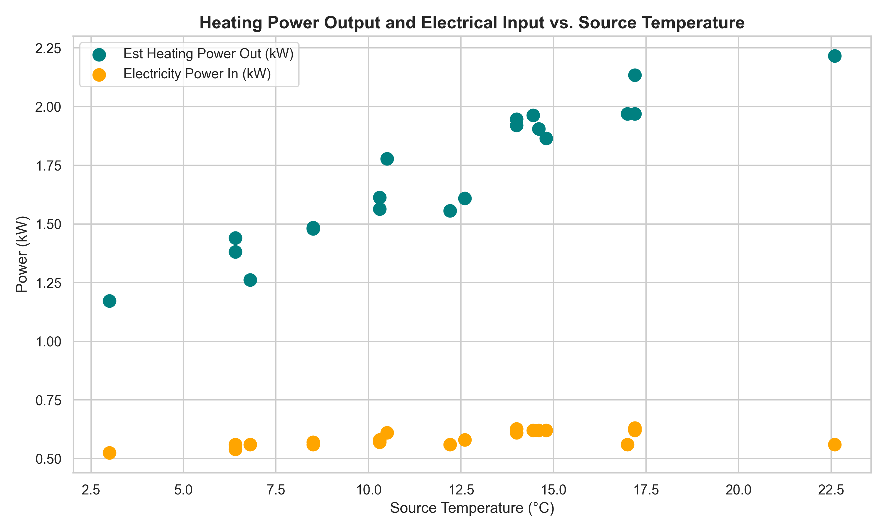
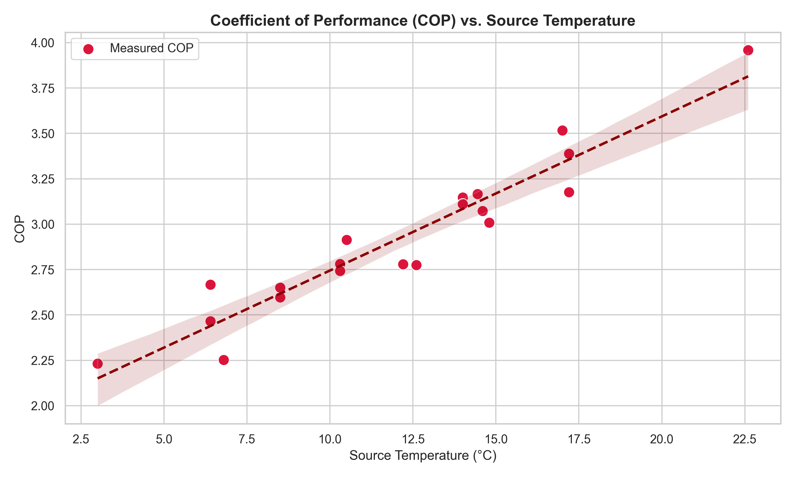
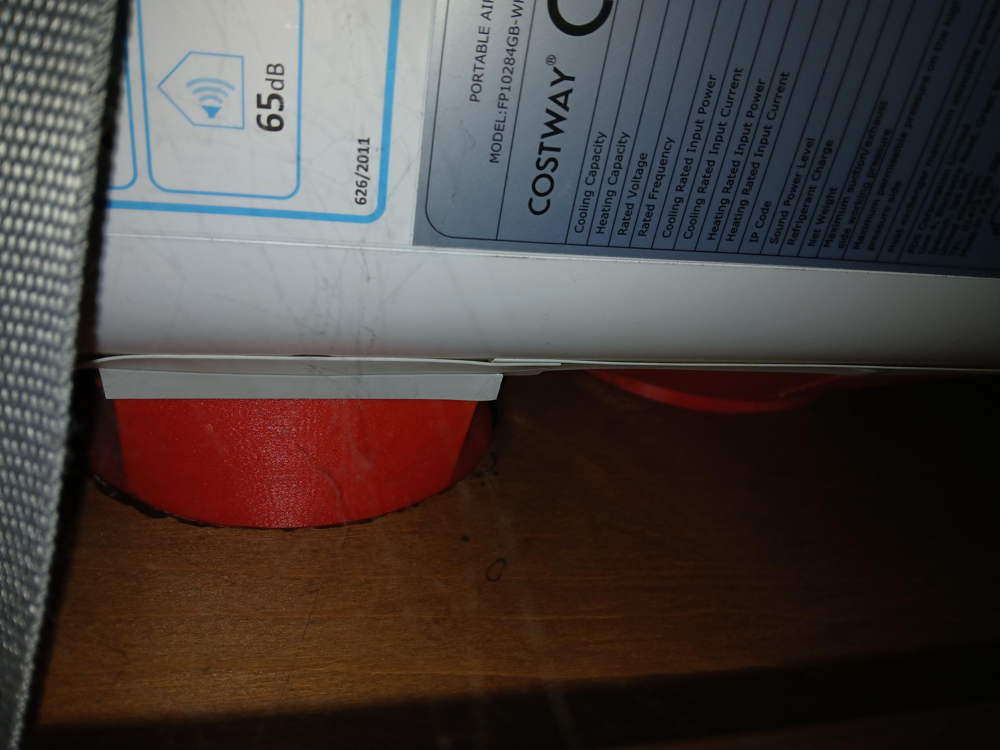
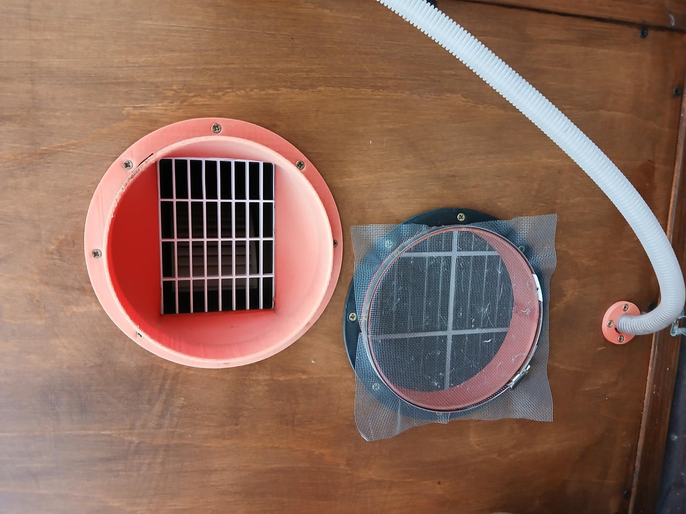

# HeatPumpDualHose
3D printing to convert cheap single hose heat pump to dual hose (heating/cooling). Photos show arrangment that has been operating since January 2024.  
**Under construction**

# Why?
Single-hose units expel conditioned indoor air outside, creating a vacuum which pulls outside air back into the house through cracks and gaps. Dual-hose systems draw outdoor air strictly through the second hose to exhaust heat, keeping indoor air pressure balanced. 

This a low cost heating/cooling method which is completely independant of any other heating mechanism and can be installed/removed relatively quickly. Coupled with a source which accumulates heat naturally (e.g. conservatory) then it can be a very cheap/effective method of heating in moderate conditions. The main drawbacks are that it is noisy and cannot heat up a room quickly due to the low power.

From the results shown a COP (heat energy out/electric energy in) can be 2-4 depending on the source temperature. Whilst not as good as typical mini split system, it has a much lower outlay and has much easier installation/removal which does not require any professional f-gas handling.
 
# Equipment used
This is what is used here, but many different combinations are possible:
- Costway FP10284GB 5in1 heat/cooling/dehumidifer 7000 BTU. Contains propane (R290) as the refrigerant.
- Anet A8 3D printer
- PLA filement
- Plywood/whitewood for wood surround

# Measurements
The following parameters are measured to monitor performance:
- **Electricity Power In [kW]**: Using plug in power meter
- **Source Temperature [C]**: Using DHT 11 Temperature/Humidity Sensor attached to ESP8266 Wemos D1 Mini (in source location).
- **Room In Temperature [C]**: Using DHT 11 Temperature/Humidity Sensor attached to ESP8266 Wemos D1 Mini (in room location).
- **Room Out Temperature [C]**: Using DHT 11 Temperature/Humidity Sensor attached to ESP8266 Wemos D1 Mini (attached to heat pump out).
- **Air velocity [m/s]**: Using hand held anemometer.
- **Humidity [%]**: Using DHT 11 Temperature/Humidity Sensor attached to ESP8266 Wemos D1 Mini (attached to heat pump out).

Following parameters assumed:
- **Air volume [m3/hour]**: From heat pump specifications.
- **Air density [kg/m3]**: Assumed as 1.2 kg/m3.

Calculated values:
- **Air heat capacity [KJ/K/kg]**: From lookup table vs air humidity
- **Massflow [kg/s]**: From air volume in m3/second * air density. This was checked against anemometer calculated value.
- **Est thermal power out [kW]**: From heatpump massflow * air heat capacity * (Room out - Room in tempeatures)
- **COP [kW/kW]**: From thermal power out/electrical power in

# Heating Performance

Heat performance is measured in the dual hose mode only. Although no single hose comparison measurements have been taken, for comparison the manufacturer data states a 1.8 kW output and a COP of 2.4.
Performance measurements are made with no other sources of heating running e.g. boiler/fan heater.

*Figure 1: Temperature in/out of heat pump vs. heat pump source temperature.*

*Figure 2: Input/output electricity power vs. heat pump source temperature.*

*Figure 3: COP (Heating) vs. heat pump source temperature.*

# Raw Data

| Run | Electricity Power in [kW] | Source Temp [°C] | Room In Temp [°C] | Room Out Temp [°C] | Est. $c_{air}$ [kJ/(kg·K)] | Air Humidity [kg/kg] | Room Out-In [K] | Heat Pump Flow [kg/s] | Est. Heating Power Out [kW] | COP [kW/kW] |
| --- | --- | --- | --- | --- | --- | --- | --- | --- | --- | --- |
| 1 | 0.56 | 8.5 | 17 | 32 | 1.024 | 0.01 | 15 | 0.097 | 1.48 | 2.65 |
| 2 | 0.56 | 22.6 | 18.6 | 41 | 1.024 | 0.01 | 22.4 | 0.097 | 2.22 | 3.96 |
| 3 | 0.56 | 17 | 18.6 | 38.5 | 1.024 | 0.01 | 19.9 | 0.097 | 1.97 | 3.52 |
| 4 | 0.63 | 17.2 | 18.6 | 37.4 | 1.024 | 0.01 | 18.8 | 0.111 | 2.13 | 3.39 |
| 5 | 0.62 | 17.2 | 18.6 | 38.5 | 1.024 | 0.01 | 19.9 | 0.097 | 1.97 | 3.18 |
| 6 | 0.62 | 14.8 | 18.6 | 37.4 | 1.026 | 0.0114 | 18.8 | 0.097 | 1.87 | 3.01 |
| 7 | 0.62 | 14.6 | 18.2 | 37.4 | 1.026 | 0.0114 | 19.2 | 0.097 | 1.91 | 3.07 |
| 8 | 0.62 | 14.45 | 18.2 | 38 | 1.026 | 0.011 | 19.8 | 0.097 | 1.96 | 3.17 |
| 9 | 0.58 | 12.6 | 19 | 35.2 | 1.028 | 0.012 | 16.2 | 0.097 | 1.61 | 2.77 |
| 10 | 0.56 | 12.2 | 19 | 34.7 | 1.026 | 0.011 | 15.7 | 0.097 | 1.56 | 2.78 |
| 11 | 0.58 | 10.3 | 17 | 33.3 | 1.024 | 0.01 | 16.3 | 0.097 | 1.61 | 2.78 |
| 12 | 0.57 | 10.3 | 17 | 32.8 | 1.024 | 0.01 | 15.8 | 0.097 | 1.56 | 2.74 |
| 13 | 0.61 | 14 | 18.6 | 38 | 1.024 | 0.01 | 19.4 | 0.097 | 1.92 | 3.15 |
| 14 | 0.626 | 14 | 19.4 | 39 | 1.028 | 0.012 | 19.6 | 0.097 | 1.95 | 3.11 |
| 15 | 0.61 | 10.5 | 18.2 | 33.8 | 1.028 | 0.012 | 15.6 | 0.111 | 1.78 | 2.91 |
| 16 | 0.57 | 8.5 | 16.1 | 31 | 1.028 | 0.012 | 14.9 | 0.097 | 1.48 | 2.6 |
| 17 | 0.56 | 6.4 | 16.1 | 30 | 1.028 | 0.012 | 13.9 | 0.097 | 1.38 | 2.47 |
| 18 | 0.525 | 3 | 14.4 | 26.2 | 1.028 | 0.012 | 11.8 | 0.097 | 1.17 | 2.23 |
| 19 | 0.56 | 6.8 | 16.6 | 29.3 | 1.028 | 0.012 | 12.7 | 0.097 | 1.26 | 2.25 |
| 20 | 0.54 | 6.4 | 15.7 | 30.2 | 1.028 | 0.012 | 14.5 | 0.097 | 1.44 | 2.67 |

# Cooling Performance

to be measured.

# Photos

*Figure 4: Internal view of heat pump arrangement.*

*Figure 5: External view of heat pump arrangement. Set up for cooling mode.*

# Disclaimer

This project is an independent hobbyist modification involving exclusively external 3D-printed plastic ducting, adapters, and window panels. It is not affiliated with, endorsed by, or sponsored by Costway.

Structural, Safety and Security: Ensure all components are securely fitted to prevent accidental drops or compromised home security. In particular, the heat pump itself contains propane as the refrigerant so ensure this is securely fastened against accidental dropage to ensure no release of flammable materials. Make sure you are happy with the risks and any associated implications of using these instructions in any way.

No Warranty: All 3D printing files and project designs are provided "as is" without warranty of any kind. Replication and use of these designs are entirely at your own risk.
